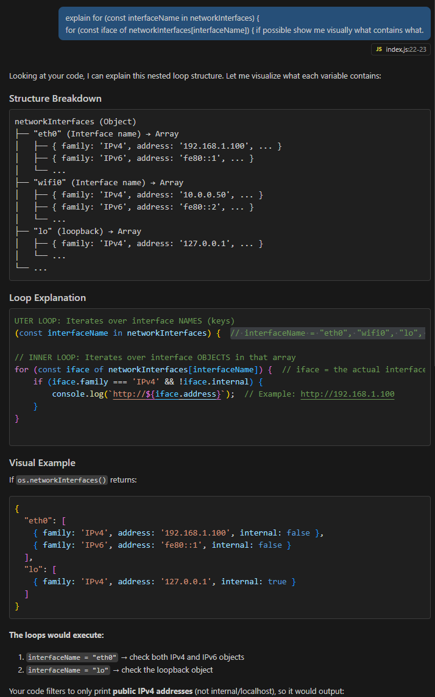
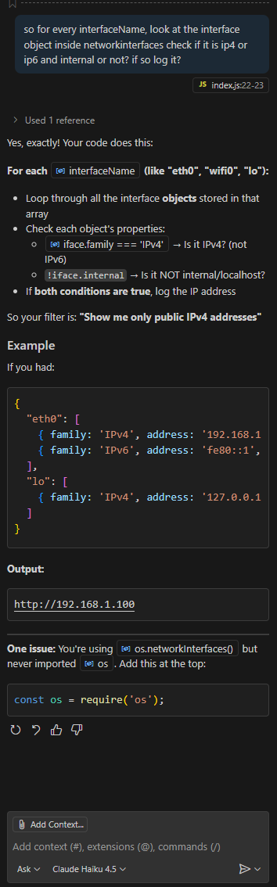

# Keanu's Development Diary.

## concept:
The concept of my project is to build upon my previous project from last year (https://keanupl.be/clicker/) and create a new way of playing the clicker game.

In this new version, the player will be able to connect using their smartphone. By saying the words **two** or **three** into their phone, the game will recognize the command and determine whether to shoot a two-pointer or a three-pointer.
<br><br>

### steps:
- CONNECTING: establishing connection between peers.
- TRANSPORTING DATA: transporting data from peer to peer.
- MODEL: creating and implementing a model that understands which word we say (**two** or **three**).
- TWEAKING: the game will need some tweeks for it to actually work.

<br><br>

## connection: 

To establish a connection I think it was important to understand the following things.
- First thing is that we need a QR-code for the peers to find eachother. 
- Second is that we use the server as a middle man in the signalling.
- Third we need to incorporate ICE for the peers to find potential routes between them.

When looking at those points it becomes clear that this assignment is a mix of exercise made in class. The qr-code will deliver a url, inside the url we will find the socketID of the receiver. We can than use that socket ID inside the sender, and send a peerOffer. From that point it's the same as the webRTC exercise in class.

<br><br>

### server

To start this project I will start with creating the server-side, inside of index.js,
This will probably be very similar to the webRTC project provided to us.

At the moment I think the most important change is the listener, this needs to function for devices on the same network. I simply replaced:

```
server.listen(port, () => {
 console.log(`App listening on port ${port}!`);
});
```

with the snippent from the qr exercise:

```
server.listen(port, () => {
  const networkInterfaces = os.networkInterfaces();//list of all network interfaces devices could use to connect to  this server. (e.g. wifi, ethernet, etc.)
  for (const interfaceName in networkInterfaces) { // for each interface name (e.g. "eth0", "wifi0", "lo", etc.)
    for (const iface of networkInterfaces[interfaceName]) { // for each interface object in that array (e.g. { family: 'IPv4', address: '192.168.1.2' })
      if (iface.family === 'IPv4' && !iface.internal) { //check if it is an IPv$ and not internal
        console.log(`http://${iface.address}`);//log the adress in the terminal to make it easy to access
      }
    }
  }
  console.log(`App listening on port ${port}!`);
});

```

I asked several questions to my AI as I usually do. I always want to understand what I am doing and that is why I added comments next to it, that explain this snippet.

That way I also realised that I have to change the port number from 443 to 80 for http, but this might cause some problems in the future, as I vaguely remember that webRTC can only use https.

 

<br><br>
I usually try to understand the explanation, and than form my way of understanding it back. That way the AI can clearly see where I missunderstand certain concepts. This time I seem to have understood the concept fairly well.
<br><br>




As for now, the server works and directs us to the index.html(receiver).


<br><br>

### receiver (index.html)

Right now i simply had an html document saying "hy". This was to see if the server will serve the public folder and find the index.html file.

We now know it does, so next up is building the qr code.
This will also be pretty similar to the qr code exercise for now.

After checking the receiver file in the qr code exercise I grabbed the qr code creation snippet and pasted it inside my code:

```

<div id="qr"></div>
  <script src="/socket.io/socket.io.js"></script>
  <script src="https://cdnjs.cloudflare.com/ajax/libs/qrcode-generator/1.4.4/qrcode.min.js" integrity="sha512-ZDSPMa/JM1D+7kdg2x3BsruQ6T/JpJo3jWDWkCZsP+5yVyp1KfESqLI+7RqB5k24F7p2cV7i2YHh/890y6P6Sw==" crossorigin="anonymous"></script>
  <script>
    {
    let socket; // will be assigned a value later
    
    const init = () => {
      socket = io.connect('/');
      socket.on('connect', () => {
        console.log(`Connected: ${socket.id}`);
        const url = `${new URL(`/sender.html?id=${socket.id}`, window.location)}`;
      

        const typeNumber = 4;
        const errorCorrectionLevel = 'L';
        const qr = qrcode(typeNumber, errorCorrectionLevel);
        qr.addData(url);
        qr.make();
        document.getElementById('qr').innerHTML = qr.createImgTag(4);
      });
    };

    init();
  }
  </script>

```

After pasting it in I simply had to change the url to fit my file structure. This meant I had to change the name from controller.html to sender.html. Not sure if this is relavant but for this I obviously did not use AI.

I tested the scan on my phone, to see if the socketID is correctly being passed. So that means we can now move on to the sender.

<br><br>

### sender (index.html)

In the sender the first thing we need to do is capture the socketID from the receiver out of the url. We than use that socketID to be able to send a peerOffer.

Luckily we already received the snippet of code to grab the socketID out of the url, from the QR-exercise.

I also ***pasted the WebRTC exercise's sender.html file in my own***, This way I don't have to rewrite everything, and I can just tweak what needs to be tweaked.

#### capturing the socketID

First I took a look at the init function from the sender inside the webrtc exercise:

```  
 const init = async () => {
      initSocket();
      $peerSelect.addEventListener('input', callSelectedPeer);
      const constraints = { audio: true, video: { width: 1280, height: 720 } };
      myStream = await navigator.mediaDevices.getUserMedia(constraints);
      $myCamera.srcObject = myStream;
    };
```

Now I know exactly where we need to use the socketID. CallSelectedPeers was an event handler that simply looked inside the dropdown menu grabbed the value (string of the socketID) and passed it to the callpeer function. 

The callpeer function is one I would like to re-use, so that means we have to replace the CallSelectedPeer eventhandling logic, and replace it with the socketID from the url logic.

PS: I deleted the video streaming logic, and changed my constraints to {data:true}, because I simply want to pass strings from peer to peer.

```   const getUrlParameter = name => {
      name = name.replace(/[\[]/, '\\[').replace(/[\]]/, '\\]');
      const regex = new RegExp('[\\?&]' + name + '=([^&#]*)');
      const results = regex.exec(location.search);
      return results === null ? false : decodeURIComponent(results[1].replace(/\+/g, ' '));
    };
```

This snippet of code will return the value of a given query string. I don't think it is very important for me to now understand the exact details on how it works. I am mostly viewing this as a tool I use to reach the desired outcome.

This is what the new init looks like:

```
  const init = async () => {
      initSocket();
      targetSocketID = getUrlParameter('id');//grab the socketID from url id querystring.
      console.log(`target: ${targetSocketID}`);
      
      const constraints = { data:true };
    };
```

#### callingPeer

For my project I don't want to send video or audio, but I want to send string variables, this also means that the callpeer function needs to be tweaked for this to work.

I look around online and found the following article: https://stackoverflow.com/questions/23264266/webrtc-sending-string-messages