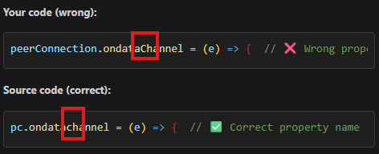

# Keanu's Development Diary.

## concept:
The concept of my project is to build upon my previous project from last year (https://keanupl.be/clicker/) and create a new way of playing the clicker game.

In this new version, the player will be able to connect using their smartphone. By saying the words **two** or **three** into their phone, the game will recognize the command and determine whether to shoot a two-pointer or a three-pointer.
<br><br>

### steps:
- CONNECTING: establishing connection between peers.
- TRANSPORTING DATA: transporting data from peer to peer.
- MODEL: creating and implementing a model that understands which word we say (**two** or **three**).
- TWEAKING: the game will need some tweaks for it to actually work.

<br><br>

## connection: 

To establish a connection, I think it was important to understand the following things.
- First thing is that we need a QR-code for the peers to find each other. 
- Second is that we use the server as a middle man in the signalling.
- Third we need to incorporate ICE for the peers to find potential routes between them.

When looking at those points it becomes clear that this assignment is a mix of exercises made in class. The QR-code will deliver a URL, inside the URL we will find the socketID of the receiver. We can then use that socket ID inside the sender, and send a peerOffer. From that point it's the same as the webRTC exercise in class.

<br><br>

### server

To start this project I will start with creating the server-side, inside of index.js,
This will probably be very similar to the webRTC project provided to us.

At the moment I think the most important change is the listener, this needs to function for devices on the same network. I simply replaced:

```
server.listen(port, () => {
 console.log(`App listening on port ${port}!`);
});
```

with the snippet from the QR exercise:

```
server.listen(port, () => {
  const networkInterfaces = os.networkInterfaces();//list of all network interfaces devices could use to connect to  this server. (e.g. wifi, ethernet, etc.)
  for (const interfaceName in networkInterfaces) { // for each interface name (e.g. "eth0", "wifi0", "lo", etc.)
    for (const iface of networkInterfaces[interfaceName]) { // for each interface object in that array (e.g. { family: 'IPv4', address: '192.168.1.2' })
      if (iface.family === 'IPv4' && !iface.internal) { //check if it is an IPv$ and not internal
        console.log(`http://${iface.address}`);//log the adress in the terminal to make it easy to access
      }
    }
  }
  console.log(`App listening on port ${port}!`);
});

```

> **🤖 AI Used:** I asked several questions to my AI as I usually do. I always want to understand what I am doing and that is why I added comments next to it, that explain this snippet.

That way I also realised that I have to change the port number from 443 to 80 for http, but this might cause some problems in the future, as I vaguely remember that webRTC can only use https.

 

<br><br>

> **🤖 AI Used:** I usually try to understand the explanation, and then form my way of understanding it back. That way the AI can clearly see where I misunderstand certain concepts. This time I seem to have understood the concept fairly well.

<br><br>


As for now, the server works and directs us to the index.html(receiver).


<br><br>

### receiver (index.html)

Right now I simply had an HTML document saying "hi". This was to see if the server will serve the public folder and find the index.html file.

We now know it does, so next up is building the qr code.
This will also be pretty similar to the qr code exercise for now.

After checking the receiver file in the qr code exercise I grabbed the qr code creation snippet and pasted it inside my code:

```

<div id="qr"></div>
  <script src="/socket.io/socket.io.js"></script>
  <script src="https://cdnjs.cloudflare.com/ajax/libs/qrcode-generator/1.4.4/qrcode.min.js" integrity="sha512-ZDSPMa/JM1D+7kdg2x3BsruQ6T/JpJo3jWDWkCZsP+5yVyp1KfESqLI+7RqB5k24F7p2cV7i2YHh/890y6P6Sw==" crossorigin="anonymous"></script>
  <script>
    {
    let socket; // will be assigned a value later
    
    const init = () => {
      socket = io.connect('/');
      socket.on('connect', () => {
        console.log(`Connected: ${socket.id}`);
        const url = `${new URL(`/sender.html?id=${socket.id}`, window.location)}`;
      

        const typeNumber = 4;
        const errorCorrectionLevel = 'L';
        const qr = qrcode(typeNumber, errorCorrectionLevel);
        qr.addData(url);
        qr.make();
        document.getElementById('qr').innerHTML = qr.createImgTag(4);
      });
    };

    init();
  }
  </script>

```

After pasting it in I simply had to change the URL to fit my file structure. This meant I had to change the name from controller.html to sender.html. Not sure if this is relevant but for this I obviously did not use AI.

I tested the scan on my phone, to see if the socketID is correctly being passed. So that means we can now move on to the sender.

<br><br>

### sender (index.html)

In the sender the first thing we need to do is capture the socketID from the receiver out of the url. We than use that socketID to be able to send a peerOffer.

Luckily we already received the snippet of code to grab the socketID out of the url, from the QR-exercise.

I also ***pasted the WebRTC exercise's sender.html file in my own***, This way I don't have to rewrite everything, and I can just tweak what needs to be tweaked.

<br><br>

#### capturing the socketID

First I took a look at the init function from the sender inside the webrtc exercise:

```  
 const init = async () => {
      initSocket();
      $peerSelect.addEventListener('input', callSelectedPeer);
      const constraints = { audio: true, video: { width: 1280, height: 720 } };
      myStream = await navigator.mediaDevices.getUserMedia(constraints);
      $myCamera.srcObject = myStream;
    };
```

Now I know exactly where we need to use the socketID. CallSelectedPeers was an event handler that simply looked inside the dropdown menu grabbed the value (string of the socketID) and passed it to the callpeer function. 

The callpeer function is one I would like to re-use, so that means we have to replace the CallSelectedPeer eventhandling logic, and replace it with the socketID from the url logic.

PS: I deleted the video streaming logic.

```   const getUrlParameter = name => {
      name = name.replace(/[\[]/, '\\[').replace(/[\]]/, '\\]');
      const regex = new RegExp('[\\?&]' + name + '=([^&#]*)');
      const results = regex.exec(location.search);
      return results === null ? false : decodeURIComponent(results[1].replace(/\+/g, ' '));
    };
```

This snippet of code will return the value of a given query string. I don't think it is very important for me to now understand the exact details on how it works. I am mostly viewing this as a tool I use to reach the desired outcome.

This is what the new init looks like:

```
  const init = async () => {
      initSocket();
      targetSocketID = getUrlParameter('id');//grab the socketID from url id querystring.
      console.log(`target: ${targetSocketID}`);
    };
```
<br><br>

#### callingPeer()

For my project I don't want to send video or audio, but I want to send string variables, this also means that the callpeer function needs to be tweaked for this to work.

I look around online and found the following article: https://stackoverflow.com/questions/23264266/webrtc-sending-string-messages

this article than send me towards: https://developer.mozilla.org/en-US/docs/Web/API/RTCPeerConnection/createDataChannel

It was clear that I had to  use a dataChannel.

I followed the documentation, and made the following change:

```
  const attemptPeerCall = () => {
            targetSocketID = getUrlParameter('id');//grab the socketID from url id querystring.
              console.log(`target: ${targetSocketID}`);
            callPeer(targetSocketID)
        }

        const callPeer = async (peerId) => {
            peerConnection = new RTCPeerConnection(servers);
            // add the video stream
            const dataChannel = peerConnection.createDataChannel('shot');
            setupDataChannel(dataChannel);

            peerConnection.onicecandidate = (e) => {
                console.log('ice candidate', e.candidate);
                socket.emit('peerIce', peerId, e.candidate);
            };
            const offer = await peerConnection.createOffer();
            await peerConnection.setLocalDescription(offer);
            socket.emit('peerOffer', peerId, offer);
        };
```

On the receiver's side there are still things that need to change to be able to handle this communication.

<br><br>

#### callingPeer() on receiver's side

I first included the logic that handles the peerOffer and peerIce events.

I eventually tried to see if the connection works, but I got this error: 

```
(index):51 Uncaught (in promise) TypeError: Failed to construct 'RTCPeerConnection': The provided value is not of type 'RTCConfiguration'.

```

> **🤖 AI Used:** I throw it inside of my AI agent, and asked for the problem. 

and apparently I forgot to include the following snippet in my index.html: 

```
   const servers = {
                iceServers: [{
                    urls: `stun:stun.l.google.com:19302`
                }]
            };
```

One problem that is occuring at the moment is that my the dataChannel messages are not firing.

> **🤖 AI Used:** After looking for a while I was so confused, and I threw my source inside of the AI.

<br><br>



<br><br>

turned out I used a capital letter in the wrong place.

<br><br>

## transporting data

I technically already included transporting data inside of the connection topic of the project, but in this part I will try to use that data inside of the receiver's part. Right now I am also only transporting when the connection is established, and I am not yet capable of transporting data at will. To figure this out, I will place a button on the sender's side. Every time the button is pressed I want to send "hello" to the receiver.

On the receiver's side I will capture the data, put it in a variable, and paste it on the page. If that works I can implement the word recognition logic.
<br><br>

### transporting data at will

> **🤖 AI Used:** Because I wanted to know if there was a way to filter the type of message we could send, and make the listener listen for a specific event w/ webrtc just like we do with webSockets (e.g: socket.on(`peer offer`)) I asked AI. It said we could use json for this and include a type and thn the actual data: 
<br><br>

```
const handleClick = (channel) => {
    channel.send(JSON.stringify({ type: 'shot', data: 'something' }));
}
```
<br><br>
and on the receiver's side:
<br><br>

```

channel.onmessage = (event) => {
    const message = JSON.parse(event.data);
    
    switch (message.type) {
        case 'shot':
            handleShot(message.data);
            break;
        case 'hello':
            handleHello(message.data);
            break;
        default:
            console.log('Unknown event:', message.type);
    }
};

```
<br><br>

This way I could handle different types of messages on the receiver's side.
After tweaking and testing, this indeed seems to work perfectly which is awesome. 

<br><br>

## Model

### http -> https
Next up is to include my model that will have to recognize the difference between "two" or "three", I already used such a model in the previous 
assignment: https://keanupl.be/experience/.

The idea is to let this model recognize what the user says on the sender's side. Based on that it will send the string value of the word to the receiver. 

So again I am not handling the audio recognition on the receiver's side, but on the sender's side and passing that string value.

Luckily I already have the logic and code in this previous project, and also a model that I can use now just for testing. 

I copied the following snippet of code: 

```
const listening = async () => {//sets up the speech command model and listening function
    const baseURL = window.location.href.substring(0, window.location.href.lastIndexOf('/') + 1);
    const modelPath = baseURL + "models/blocked/";

    const recognizer = speechCommands.create(
        "BROWSER_FFT", 
        undefined, 
        modelPath + "model.json", //use following model
        modelPath + "metadata.json" //use this weights file
    );

    await recognizer.ensureModelLoaded();

    $micIcon.style.opacity = 0.2;

    console.log("Model ready! Listening..."); //everything loaded in

    recognizer.listen(async result => {

        // result.scores = prediction probabilities for each class
        const scores = result.scores; // array with two probabilitie scores ex:[0.92,08]
        const labels = recognizer.wordLabels(); //grabs the labels [blocked,background-noise]
        const index = scores.indexOf(Math.max(...scores)); //which one has the heightes probability score -> takes position of that value over the spread out array

        // Display which word was detected
        console.log("Detected:", labels[index]);


        if (labels[index] === "Blocked") {
            playing = true;
            console.log("Blocked by JAMES");
            $videoBlocked.play();
        }


    }, { 
        // How much audio overlaps between predictions (0.1–0.9)
        overlapFactor: 0.5,

        // Minimum confidence required to report a word
        probabilityThreshold: 0.7,

        includeSpectrogram: false
    });
}
```
<br><br>

Changed a few little things such as the path and ended up with this:

```
    const listening = async () => {//sets up the speech command model and listening function
            const baseURL = window.location.href.substring(0, window.location.href.lastIndexOf('/') + 1);
            const modelPath = baseURL + "model/blocked/";

            const recognizer = speechCommands.create(
                "BROWSER_FFT",
                undefined,
                modelPath + "model.json", //use following model
                modelPath + "metadata.json" //use this weights file
            );

            await recognizer.ensureModelLoaded();

            console.log("Model ready! Listening..."); //everything loaded in

            recognizer.listen(async result => {

                // result.scores = prediction probabilities for each class
                const scores = result.scores; // array with two probability scores ex:[0.92,0.08]
                const labels = recognizer.wordLabels(); //grabs the labels [blocked,background-noise]
                const index = scores.indexOf(Math.max(...scores)); //which one has the highest probability score -> takes position of that value over the spread out array

                // Display which word was detected
                console.log("Detected:", labels[index]);


                if (labels[index] === "Blocked") {

                    console.log("Blocked by JAMES");
                }


            }, {
                // How much audio overlaps between predictions (0.1–0.9)
                overlapFactor: 0.5,

                // Minimum confidence required to report a word
                probabilityThreshold: 0.7,

                includeSpectrogram: false
            });
        }
```

<br><br>

Then there it was the error I was already expecting from the beginning of the project: 

```
speech-commands:17 Uncaught (in promise) TypeError: Cannot read properties of undefined (reading 'getUserMedia')

```

<br><br>

This error is because right now I am using http, but tensorflow can only work with https or localhost. So I will have to switch to using https.

> **🤖 AI Used:** I discussed possible solutions for my index.js file with my AI, and I decided on using a provided solution by AI that will checks if we have a new IP or not.
If our ip is not new, and we have the certificates thn we do nothing.

If our ip is different, than we generate new certificates for it. These certificates make it so that we can encrypt data, and to identify ourselves. The browser won't allow sensitive features on insecure connections meaning we won't be able to use our mic.

To create those certificates we use execSync which allows us to write a command in the terminal and wait until its done. The command we run is the following:


```
 openssl req -x509 -newkey rsa:2048 -keyout key.pem -out cert.pem -days 365 -nodes -subj "/CN=${ip}" -addext "subjectAltName=DNS:localhost,IP:${ip}"
```
<br><br>

The full certificate function currently looks like this:

```
const generateCertificate = (ip) => {
  const certExists = fs.existsSync('./cert.pem') && fs.existsSync('./key.pem');//check if the certificates already exist
  const ipFile = '.lastIP';
  const lastIP = fs.existsSync(ipFile) ? fs.readFileSync(ipFile, 'utf8') : '';

  if (certExists && lastIP === ip) {
    console.log(`Using existing certificate for ${ip}`);
    return;
  }

  console.log(`Generating certificate for ${ip}...`);
  try {
    execSync(
      `openssl req -x509 -newkey rsa:2048 -keyout key.pem -out cert.pem -days 365 -nodes -subj "/CN=${ip}" -addext "subjectAltName=DNS:localhost,IP:${ip}"`,
      { stdio: 'ignore' }
    );
    fs.writeFileSync(ipFile, ip);//save ip -> helps with remembering
    console.log(`✅ Certificate generated!`);
  } catch (err) {
    console.error('❌ Failed to generate certificate. Make sure openssl is installed.');
    process.exit(1);
  }
};
```

<br><br>

As you can see this function expects an ip parameter. That means we have to be able to use our current ip address.
This is very similar to how we previously did it only this time we won't past the link in the console. That is because the link would be accessible, even if the server is not listening yet. The code looks like this: 

```
const getLocalIP = () => {
  const networkInterfaces = os.networkInterfaces();//list of all network interfaces devices could use to connect to  this server. (e.g. wifi, ethernet, etc.)
  for (const interfaceName in networkInterfaces) { // for each interface name (e.g. "eth0", "wifi0", "lo", etc.)
    for (const iface of networkInterfaces[interfaceName]) { // for each interface object in that array (e.g. { family: 'IPv4', address: '192.168.1.2' })
      if (iface.family === 'IPv4' && !iface.internal) { //check if it is an IPv$ and not internal
        return iface.address
      }
    }
  }
}

const localIP = getLocalIP();
```
<br><br>

because we our using dynamically generate certificates now we also have to update to options object to use them.

```
let options = {};
if (isDevelopment) {
  generateCertificate(localIP);//generate certificate for the local IP if necessary
  options = {
    key: fs.readFileSync('./key.pem'),
    cert: fs.readFileSync('./cert.pem')
  };
}

```

<br><br>
the rest of the code only changes a little with a few tweaks 

```
const server = require(isDevelopment ? 'https' : 'http').Server(options, app);
const port = process.env.PORT || (isDevelopment ? 3000 : 80);

app.use(express.static('public'));


const { Server } = require("socket.io");
const io = new Server(server);

server.listen(port, () => {
  const protocol = isDevelopment ? 'https' : 'http';

  console.log(`\n Server running!`);
  //console.log(`Local: ${protocol}://localhost:${port}`);
  console.log(`Network: ${protocol}://${localIP}:${port}\n`);
});

```

Now the code did not return any errors anymore.

> **🤖 AI Used:** For full transparency I will restate that for this part I did ask AI to help me understand the problem and come up with different solutions. I handpicked this solution because it seemed the most dynamic. The first solution seemed similar but wouldn't work when switching to a different network or when the IP address would change. These are flaws that I myself noticed, and that is why I ended up with a more dynamic solution.

<br><br>


### Chrome not compatible

A small issue I seem to have run into is the fact that Chrome on phone does not allow getUserMedia(). This means that the microphone is not accessible on the Chrome app on phone.

### using the model

To test if everything works with the current model I had to update some pieces of code.


#### sender.html

If the model detects something, it must be able to send a message with the detected word towards the receiver. That is why when the channel opens, I pass the channel to the listening function.

```
const setupDataChannel = (channel) => {
            channel.onopen = (event) => {
                console.log('Channel opened!');
                channel.send(JSON.stringify({ type: 'hello', data: 'hello' }));
                listening(channel);
            };
            channel.onmessage = (event) => {
                console.log(event.data);
            };

            $btn.addEventListener("click", () => handleClick(channel))

        }
```

The listen function sets up the model and starts listening. 

```
  const listening = async (channel) => {//sets up the speech command model and listening function
            const baseURL = window.location.href.substring(0, window.location.href.lastIndexOf('/') + 1);
            const modelPath = baseURL + "model/blocked/";

            const recognizer = speechCommands.create(
                "BROWSER_FFT",
                undefined,
                modelPath + "model.json", //use following model
                modelPath + "metadata.json" //use this weights file
            );

            await recognizer.ensureModelLoaded();

            console.log("Model ready! Listening..."); //everything loaded in

            recognizer.listen(async result => {

                // result.scores = prediction probabilities for each class
                const scores = result.scores; // array with two probability scores ex:[0.92,0.08]
                const labels = recognizer.wordLabels(); //grabs the labels [blocked,background-noise]
                const index = scores.indexOf(Math.max(...scores)); //which one has the highest probability score -> takes position of that value over the spread out array

                // Display which word was detected
                console.log("Detected:", labels[index]);


                if (labels[index] === "Blocked") {

                    console.log("Blocked by JAMES send");
                    channel.send(JSON.stringify({ type: 'blocked', data: 'by james' }));
                }


            }, {
                // How much audio overlaps between predictions (0.1–0.9)
                overlapFactor: 0.5,

                // Minimum confidence required to report a word
                probabilityThreshold: 0.7,

                includeSpectrogram: false
            });
        }
```
as you can see when sending a message I added a new type, so in the receiver we will have to update the message receiving logic.


#### index.html

In this file I simply changed the message receiver and included a new type.

```
      dataChannel.onmessage = (event) => {
                        const message = JSON.parse(event.data);

                        switch (message.type) {
                            case 'shot':
                                //handleShot(message.data);
                                console.log(`shot: ${message.data}`)
                                break;
                            case 'hello':
                                //handleHello(message.data);
                                console.log(`hello: ${message.data}`)
                                break;
                            case 'blocked':
                                //handleHello(message.data);
                                console.log(`blocked: ${message.data}`)
                                break;
                            default:
                                console.log('Unknown event:', message.type);
                        }
                    };

```
<br><br>
#### Training new model

Now that I know that my code works I took some time to train a new model that understands the difference between the words "two", "three", and background noise. 
I trained the model using Teachable Machines: https://teachablemachine.withgoogle.com/train/audio.

I gave it a lot of data and also let different people speak, to add more variation. When training I set the amount of Epochs to 1000, so it took about 7minutes for the training to be complete. After I just downloaded the zipFile and replace the current test model with this one.

To make the current code work I had to update it, because it uses different labels now: 
<br><br>

```
  const listening = async (channel) => {//sets up the speech command model and listening function
            const baseURL = window.location.href.substring(0, window.location.href.lastIndexOf('/') + 1);
            const modelPath = baseURL + "model/shot/";

            const recognizer = speechCommands.create(
                "BROWSER_FFT",
                undefined,
                modelPath + "model.json", //use following model
                modelPath + "metadata.json" //use this weights file
            );

            await recognizer.ensureModelLoaded();

            console.log("Model ready! Listening..."); //everything loaded in

            recognizer.listen(async result => {

                // result.scores = prediction probabilities for each class
                const scores = result.scores; // array with two probabilitie scores ex:[0.92,08]
                const labels = recognizer.wordLabels(); //grabs the labels [blocked,background-noise]
                const index = scores.indexOf(Math.max(...scores)); //which one has the heightes probability score -> takes position of that value over the spread out array

                // Display which word was detected
                console.log("Detected:", labels[index]);

                switch (labels[index]) {
                    case 'Two':
                        channel.send(JSON.stringify({ type: 'shot', data: 'two' }));
                        break;

                    case 'Three':
                        channel.send(JSON.stringify({ type: 'shot', data: 'three' }));
                        break;

                    default:
                        channel.send(JSON.stringify({ type: 'shot', data: 'background' }));
                }


                // if (labels[index] === "Blocked") {

                //     console.log("Blocked by JAMES send");
                //     channel.send(JSON.stringify({ type: 'blocked', data: 'by james' }));
                // }


            }, {
                // How much audio overlaps between predictions (0.1–0.9)
                overlapFactor: 0.45,

                // Minimum confidence required to report a word
                probabilityThreshold: 0.99,

                includeSpectrogram: false
            });
        }

```

I also deleted the receiver's logic to receive data from the previous model. 
